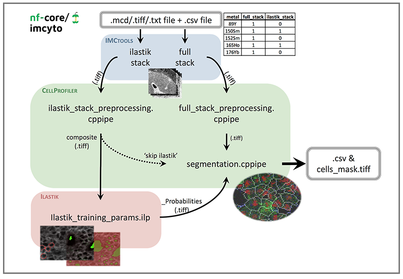
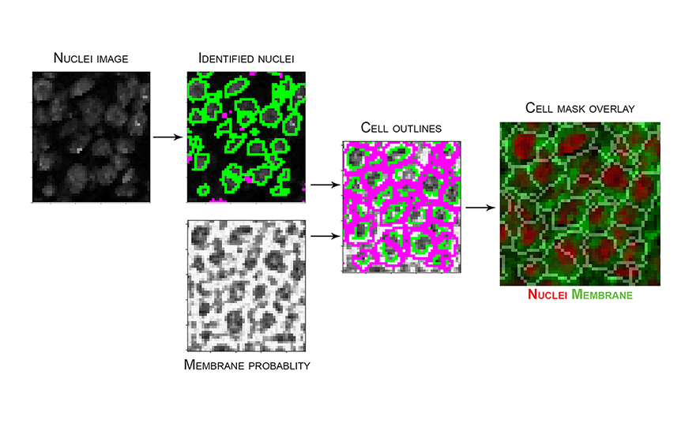
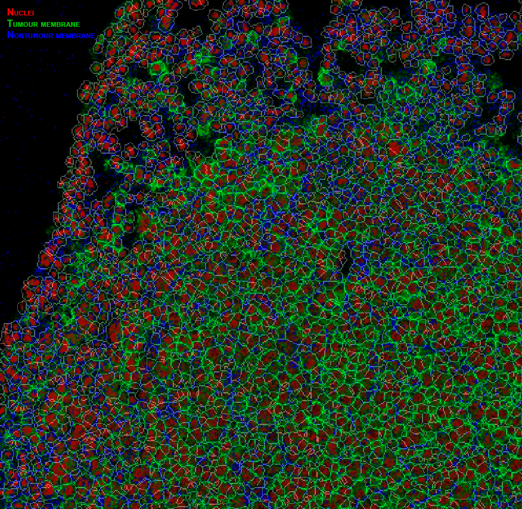
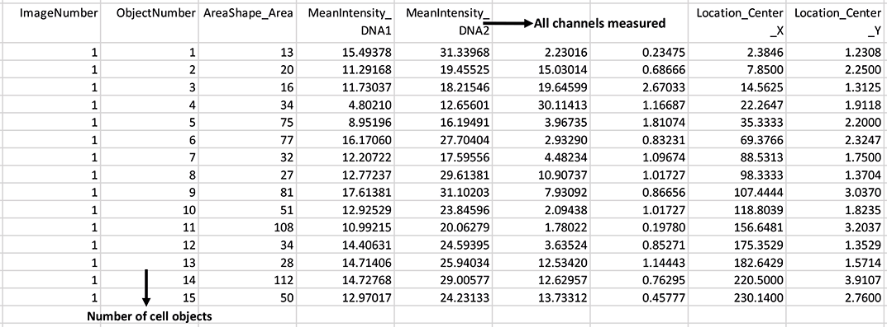

# nf-core/imcyto: Output

## Pipeline overview

The pipeline is built using [Nextflow](https://www.nextflow.io/). See main [`README.md`](../README.md#pipeline-summary) for a condensed overview of the steps in the pipeline, and the bioinformatics tools used at each step.

This is an automated pipeline for the pre-processing and single cell segmentation of imaging data generated from Imaging Mass Cytometry experiments, however, it is flexible enough to be applicable to other types of imaging data (e.g. confocal).

The input to the pipeline can be in either `mcd`, `ome.tiff` or `txt` file format from which stacks of `tiff` files are generated for subsequent analysis. The various stages of this pipeline allow the `tiff` images to be pre-processed, and segmented using multiple CellProfiler `cppipe` project files and the pixel-classification software Ilastik. The concept of this step-wise image segmentation by combining Ilastik with CellProfiler was based on the analysis pipeline as described by the Bodenmiller group [(Zanotelli & Bodenmiller, Jan 2019)](https://github.com/BodenmillerGroup/ImcSegmentationPipeline/blob/development/documentation/imcsegmentationpipeline_documentation.pdf).

The [plugins](../assets/plugins/) supplied with the pipeline constitute the minimal requirements to generate a single cell mask. A more refined and comprehensive pipeline will be uploaded in due course.

This pipeline is designed to run on most compute infrastructures without the need to pre-install any of the software packages. However, in order to initially create the custom plugin files required by the pipeline, one needs to install the latest GUI versions of [CellProfiler](https://cellprofiler.org/releases/) and [Ilastik](https://www.ilastik.org/download.html) on a local machine (see [Pipeline Adaptations](#pipeline-adaptations)).  

## Pipeline schematic

## Pipeline prerequisites

- `mcd`, `ome.tiff` or `txt` data file(s) without any spaces in the file name. Associated antibody panel should contain metal and antibody information in the form of "metal_antibody" e.g. `89Y_CD45`.

- **metadata.csv** file containing your antibody panel to identify which corresponding .tiff files are to be put into full_stack and ilastik_stack folders (example shown in **Pipeline Workflow Schematic**). File should contain only three columns titled ‘metal’, ‘full_stack’ and ‘ilastik_stack’. ‘metal’ column should contain all the metals used in your antibody panel. ‘full_stack’ and ‘ilastik_stack’ columns should be used to identify which metals to include in boolean labelling (1 = use or 0 = don’t use).

- **‘NamesAndTypes’** module in all CellProfiler .cppipe files (see **Pipeline Adaptations**) will need to be edited to match your antibody panel and desired markers to identify cell nuclei and membranes. Other recommended changes to the pipeline are outlined below - **Pipeline Details**.

## Pipeline Adaptations:

- To view and edit the .cppipe files, download [CellProfiler(v3.1.8)](https://cellprofiler.org/ 'CellProfiler') as well as the custom plugins created by Bodenmiller group - smoothmultichannel.py and measureobjectintensitymultichannel.py (found [here](https://github.com/BodenmillerGroup/ImcPluginsCP 'CellProfiler Bodenmiller custom plugins')). Your own custom plugins can also be used. Open CellProfiler>Preferences and change ‘CellProfiler plugins directory’ path to where you stored the custom plugins. When saving the edited .cppipe files, make to sure export the file as a .cppipe and to name the files as either ‘full_stack_preprocessing’, ‘ilastik_stack_preprocessing’ or ‘segmentation’ in line with the schematic above.

- If you use any custom modules in any of the CellProfiler .cppipe files, make sure to add the python script into the ‘plugins/cp_plugins’ directory before running the pipeline (described below – **Pipeline Execution**).

- The pipeline is packaged with a pre-trained Ilastik pixel classifer but to train a classifier using your own dataset download [Ilastik(v1.3.3)](https://www.ilastik.org/ 'Ilastik'), you will need to input desired composite RGB images in .tiff format and use ‘membrane’, ‘nuclei’ and ‘background’ labels to train your classifer. The input image should be the output of ‘ilastik_stack_preprocessing’. When selecting export settings select source as ‘Probabilities’, transpose axis order to ‘cyx’ and export output file as ‘tiff sequence’ to generate probability maps. The Ilastik file should be titled ‘ilastik_training_params.ilp’.

- Adding to the flexiblity of this pipeline we have included a --skip_ilastik flag in the run.sh script as an optional argument that can be included to skip the Ilastik pixel classification step and proceed via a CellProfiler only pipeline. In this case, no --ilastik_training_ilp is provided in the run.sh script and images that have been preprocessed through ‘ilastik_stack_preprocessing.cppipe’ will be directly passed to the 'segmentation.cppipe' bypassing Ilastik. This approach might be preferred if CellProfiler alone is deemed sufficient to achieve a reliable segmentation mask.

- Additionally, --compensation_tiff is an optional argument to the pipeline, included if the user wishes to apply a predetermined spillover compensation function or illumination function to images during one or both of the ilastik_stack and full_stack preprocessing steps. If a compensation .tiff file is provided, it should be saved in the mcd folder along with the images to be processed and metadata (described below – **Pipeline Execution**). Examples of compensation might include: illumination correction to microscopy images, spillover compensation for imaging mass cytometry data.

## Pipeline Details:

Each step of the pipeline as depicted in the schematic is broken down and explained below, with the inputs and outputs highlighted.

### 1. IMCTools
**Input:** .mcd, .ome.tiff or .txt file and metadata.csv file.
- Opens data files and any contained ROIs and converts each channel into individual .tiff files.
- Uses metadata.csv file to sort .tiffs into into corresponding folders (full_stack/ilastik_stack).

**Output:** full_stack and ilastik_stack folders containing .tiffs.

### 2. full_stack_preprocessing
**Input:** full_stack of .tiff images generated by IMCTools step.
- This step selects all images in full_stack folder and sequentially processes them through various filtering methods, including removal of hot pixels and median filter, and then saves all files.
- These image filtering parameters can be changed by opening and customising the cppipe file in CellProfiler.
- To keep your data raw, uncheck all the modules except ‘SaveImages’. This will simply re-save the unchanged input images into the correct place for the next step in the pipeline.
- Make sure to export a .cppipe file titled ‘full_stack_preprocessing’.

**Output:** full_stack folder containing processed .tiffs.

### 3. ilastik_stack_preprocessing
**Input:** ilastik_stack of .tiff images generated by IMCTools step.
- This step first selects specific files by finding matching names and labels them as either ‘membrane’ and ‘nuclei’. These images are then filtered and merged to create an RGB composite image, which is saved as composite.tiff.
- Open .cppipe file in CellProfiler to change names of input images in ‘NamesAndTypes’. Select markers that are representative of total cell plasma membranes and cell nuclei. If one marker does not cover all cell type membranes, then various membrane markers can be merged by adding in an ‘ImageMath’ module to create a total membrane image, this image will need to be titled ‘membrane’.
- Further parameters can be customised, such as the filtering methods and parameters.
- Make sure to export a .cppipe file titled ‘ilastik_stack_preprocessing’.

**Output:** ilastik_stack folder containing a .tiff image titled ‘composite’.

### 4. ilastik_training_params
**Input:** composite.tiff generated by ilastik_stack_preprocessing step.
- Pixels are classified into three sets: membrane, nuclei and background by Ilastik using a pretrained pixel classifer to generate and save a probability map of each.
- If required, the ilastik classifier can be retrained using a new dataset. These inputs should be the output composite image of ‘ilastik_stack_preprocessing’ step. When selecting export settings, select source as ‘Probabilties’, transpose axis order to ‘cyx’ and export output file as ‘tiff sequence’ to generate probability maps.
- Make sure to save ilastik classifier as ‘ilastik_training_params.ilp’.
- To skip the Ilastik pixel classification altogether, a --skip_ilastik flag in the run.sh script can be included. In this case, no --ilastik_training_ilp is provided in the run.sh script and images that have been preprocessed through ‘ilastik_stack_preprocessing.cppipe’ will be directly passed to the 'segmentation.cppipe' bypassing Ilastik.

**Output:** three .tiff images titled ‘composite_Probabilities_’ ending in either 0 (for membrane), 1 (for nuclei) or 2 (for background).

### 5. segmentation
**Input:** preprocessed full_stack of .tiff images generated by full_stack_preprocessing step and composite_Probabilities_ generated by Ilastik or composite.tiff if Ilastik is skipped.
- Open .cppipe file in CellProfiler to change names of input images in ‘NamesAndTypes’ to match your antibody panel, making sure to keep ‘_Probabilities_0’ as prob_membrane and ‘_Probabilities_2’ as prob_background.
- Currently, this process uses the nuclear image to identify nuclei as primary objects, subtracts background probability from the membrane probability image and then uses both identfied nuclei and membrane porbabily to identify whole cells as secondary objects. These cell objects are then converted into a unit16 image to generate the cell mask and saved. The cell mask is then used to measure size and shape information of all cell objects, and extract single cell expression data.
- You may need to adapt parameters present in ‘IdentifyPrimaryObjects’ and ‘IdentifySecondaryObjects’ modules to best suit your data. Common changes include typical diameter size in pixels of nuclear objects, thresholding strategy and method to distinguish clumped objects. Alternatively, one can opt for using the nuclei probability output (‘_Probabilities_1) from Ilastik to identify the nuclei as primary objects.
- Within ‘MeasureObjectIntensity Multichannel’ you will need to select all the images that you would like the intensity to be measured for.
- Further parameters can be customised, such as the desired measurements to export in ‘ExportToSpreadsheet’. Currently this pipeline exports data only for each cell object: area, mean intensity, object center location and object number.
- Make sure to export a .cppipe file titled ‘segmentation’.

**Output:** .tiff image titled ‘Cells_mask’ and ‘Cells.csv’ file containing single cell data.

**Segmentation example:**

Example of the steps in segmentation.cppipe, with nuclei image input from full_stack_preprocessing and membrane probability input from ilastik, to generate the resulting cell mask (mask overlay image created in [HistoCAT](http://www.bodenmillerlab.com/research-2/histocat/ 'HistoCAT') with nuclei and membrane channels coloured in red and green respectively).

## Pipeline Execution:

To run the pipeline, you will need to login into cluster … or download from github/nextflow directly if no cluster?

The .mcd file and metadata.csv should be put together in a folder titled ‘mcd’ (if spillover compensation.tiff is available, this will also be placed in the mcd folder and added as an argument to the run.sh script). A ‘plugins’ folder should contain all three CellProfiler files (i.e. full_stack_preprocessing.cppipe, ilastik_stack_preprocessing.cppipe, segmentation.cppipe), ilastik (ilastik_training_params.ilp) parameters file as well as any extra custom CellProfiler module scripts (.py) in ‘cp_plugins’ folder. The run_imcyto script should be put along with these folders. Once you are ready to run the pipeline excute the sh run.imcyto command, from within the main experiment folder.

Explain how the pipeline runs ... pull latest version from Github, docker containers, online/offline, run pipeline...

**Example folder structure:**

## Pipeline Outputs:

Once the pipeline has completed it will generate new folders within the main folder (shown below - **Example output folder structure**). The results folder will contain subfolders titled with the name of each step of the pipeline. Each subfolder will contain folders titled with your file name (from the original input file) and within that folders labelled by ROI. These folders contain the output files from each step in the pipeline respectively.
The pipeline_info folder contains various reports generated by the pipeline (described below - **Pipeline Reporting**).
The work folder is a working directory created by the pipeline for it to run correctly and can be useful to troubleshoot any errors.

**Example output folder structure:**

**Example cell mask output:**

(Cell mask overlay image created in [HistoCAT](http://www.bodenmillerlab.com/research-2/histocat/ 'HistoCAT') with nuclei and membrane channels coloured in red and green respectively)

**Example csv containing each object and measured mean intensities output:**

## Pipeline Reporting:

Nextflow provides excellent functionality for generating various reports relevant to the running and execution of the pipeline. This will allow you to trouble-shoot errors with the running of the pipeline, and also provide you with other information such as launch commands, run times and resource usage.

Reports generated by the pipeline - pipeline_report.html, pipeline_report.txt and software_versions.csv.

Reports generated by Nextflow - execution_report.html, execution_timeline.html, execution_trace.txt and pipeline_dag.dot.

## Common Errors and Solutions:

When there are errors in the pipeline, the pipeline log will tell you exactly which process caused the error, command executed, command output and command error, as well as the path to the process working directory (/work) which can be useful when troubleshooting.

- When the pipeline fails to run, in the first instance try to rerun it with command -resume

- The most common source of error is in the naming of the channels:

`Command output: CP-JAVA 15:04:54.326 [Thread-0] WARN  o.c.imageset.ChannelFilter - Channels have different numbers of images`

`Command error: ... Error for image set, channel=1, metadata=CD4: Image missing from channel`

Check the images chosen in metadata.csv match the names chosen in CellProfiler 'NamesandTypes' modules. Make sure all metal names are correct and unambiguous (eg. CD4 will find both CD4 and CD44 in 'NamesandTypes').

- Another common error is missing output files:

`Caused by: Missing output file(s) 'ilastik_stack/*' expected by process 'PreprocessIlastikStack (file_name_roi_1)'`

Reopen the corresponding CellProfiler cppipe file and check that the 'SaveImages' module is set to give the correct output, reexport this and rerun the pipeline.

- For ROIs larger than ~2000-2000um the pipeline may struggle/fail to compete due to reaching memory capacity during ‘IdentifyObjects’ modules in ‘segmentation.cppipe’. As a workaround for this we recommend adding in a ‘Crop’ module before identifying objects to crop your images into two. Make sure to duplicate any subsequent modules and adjust input names as required.

## Other Related Software Packages:

- [MCD Viewer](https://www.fluidigm.com/software 'MCD Viewer') software provided by the Hyperion imaging system allows users to visualise, review and export .mcd image files.

- [Fiji-ImageJ](https://imagej.net/Fiji 'Fiji') can also be used to view .mcd files but requires downloading IMCTools plugin. This plugin allows the .mcd file to be viewed as an image5D with your antibody markers as individual channels that can be toggled on/off.

- Additionally, [QuPath](https://qupath.github.io/ 'QuPath'), can also be used for visualisation with the added benefit of viewing all channels at once in a mini viewer panel.

- [HistoCAT](http://www.bodenmillerlab.com/research-2/histocat/ 'HistoCAT') software developed by the Bodenmiller lab enables visualisation of images and contains various analysis tools including PhenoGraph, tSNE, PCA and Neighbourhood analysis.

## Hyperlinks:
- Zanotelli & Bodenmiller, Jan 2019: https://github.com/BodenmillerGroup/ImcSegmentationPipeline/blob/development/documentation/imcsegmentationpipeline_documentation.pdf
- CellProfiler: https://cellprofiler.org/
- CellProfiler Bodenmiller custom plugins: https://github.com/BodenmillerGroup/ImcPluginsCP
- Ilastik: https://www.ilastik.org/
- MCD Viewer: https://www.fluidigm.com/software
- Fiji-ImageJ: https://imagej.net/Fiji
- IMCTools: https://github.com/BodenmillerGroup/imctools
- QuPath: https://qupath.github.io/
- HistoCAT: http://www.bodenmillerlab.com/research-2/histocat/
